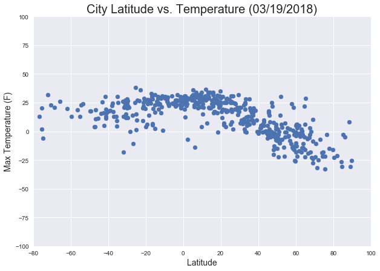
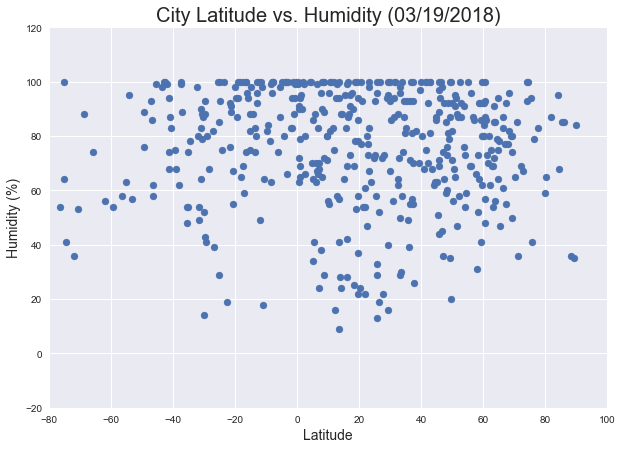
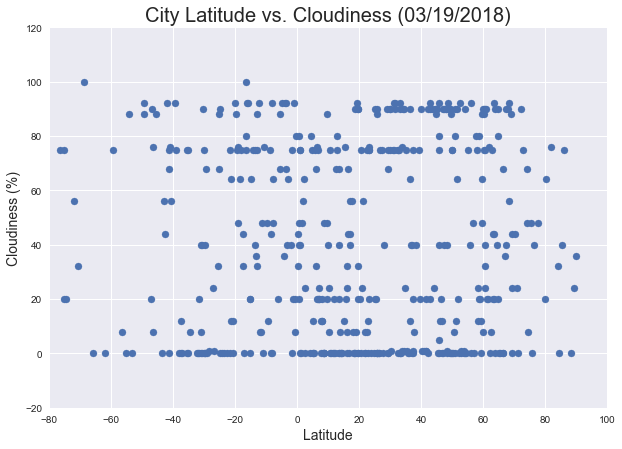
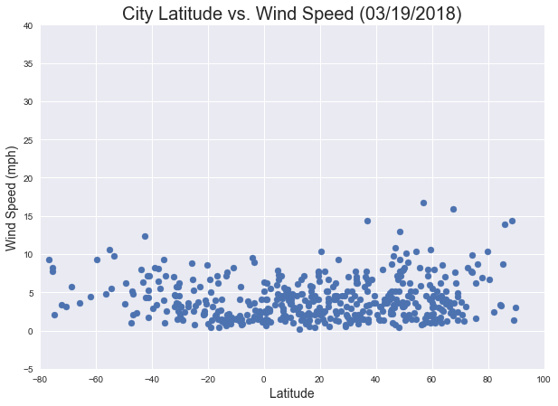

```python
#Dependencies
import pandas as pd
import numpy as np
import json
import requests
import pprint
import matplotlib.pyplot as plt
import datetime
import time
from citipy import citipy
import seaborn as sns
from config import api_key
#api_key  = "c2263875843f55996663bd446b52fcdd"
```


```python
# Save config information.
url = "http://api.openweathermap.org/data/2.5/weather?"
units = "metric"

# Build partial query URL
query_url = f"{url}appid={api_key}&units={units}&q="

# corrent date and time
now = datetime.datetime.now()
#print(now)
#print(datetime.datetime.fromtimestamp(int(response["dt"])).strftime('%Y-%m-%d %H:%M:%S'))
```


```python
# Random Selection of latitude and Longitude (1500) to be sure to get 500+ non-repeated cities
lat = np.random.uniform(low=-90.0, high=90.0, size=1200)
lon = np.random.uniform(low=-180.0, high=180.0, size=1200)
```


```python
#create a weather dataframe
weather_df = pd.DataFrame({"Latitude": lat, "Longitude": lon})
weather_df.head()
```


<div>
<style>
    .dataframe thead tr:only-child th {
        text-align: right;
    }

    .dataframe thead th {
        text-align: left;
    }

    .dataframe tbody tr th {
        vertical-align: top;
    }
</style>
<table border="1" class="dataframe">
  <thead>
    <tr style="text-align: right;">
      <th></th>
      <th>Latitude</th>
      <th>Longitude</th>
    </tr>
  </thead>
  <tbody>
    <tr>
      <th>0</th>
      <td>59.674671</td>
      <td>156.209306</td>
    </tr>
    <tr>
      <th>1</th>
      <td>-75.278894</td>
      <td>-7.877626</td>
    </tr>
    <tr>
      <th>2</th>
      <td>-88.424430</td>
      <td>-110.291555</td>
    </tr>
    <tr>
      <th>3</th>
      <td>-29.888147</td>
      <td>-165.075728</td>
    </tr>
    <tr>
      <th>4</th>
      <td>-65.792659</td>
      <td>86.391168</td>
    </tr>
  </tbody>
</table>
</div>


```python
for index, row in weather_df.iterrows():
    city = citipy.nearest_city(row["Latitude"], row["Longitude"]).city_name
    country = citipy.nearest_city(row["Latitude"], row["Longitude"]).country_code.upper()
    weather_df.set_value(index, "City", city)
    weather_df.set_value(index, "Country", country)
len(weather_df)
```


    1200


```python
weather_df.head()
```


<div>
<style>
    .dataframe thead tr:only-child th {
        text-align: right;
    }

    .dataframe thead th {
        text-align: left;
    }

    .dataframe tbody tr th {
        vertical-align: top;
    }
</style>
<table border="1" class="dataframe">
  <thead>
    <tr style="text-align: right;">
      <th></th>
      <th>Latitude</th>
      <th>Longitude</th>
      <th>City</th>
      <th>Country</th>
    </tr>
  </thead>
  <tbody>
    <tr>
      <th>0</th>
      <td>59.674671</td>
      <td>156.209306</td>
      <td>omsukchan</td>
      <td>RU</td>
    </tr>
    <tr>
      <th>1</th>
      <td>-75.278894</td>
      <td>-7.877626</td>
      <td>cape town</td>
      <td>ZA</td>
    </tr>
    <tr>
      <th>2</th>
      <td>-88.424430</td>
      <td>-110.291555</td>
      <td>punta arenas</td>
      <td>CL</td>
    </tr>
    <tr>
      <th>3</th>
      <td>-29.888147</td>
      <td>-165.075728</td>
      <td>avarua</td>
      <td>CK</td>
    </tr>
    <tr>
      <th>4</th>
      <td>-65.792659</td>
      <td>86.391168</td>
      <td>busselton</td>
      <td>AU</td>
    </tr>
  </tbody>
</table>
</div>


```python
weather_df.drop_duplicates(subset=["City","Country"], inplace=True)
len(weather_df)
```


    525


```python
#weather_df = weather_df.sample(n=600)
#len(weather_df)
```


```python
counter = 0
for index, rows in weather_df.iterrows():
    query_url = url + "appid=" + api_key + "&units=" + units + "&q=" + (rows["City"])
    response = requests.get(query_url).json()
    
    try:
        weather_df.set_value(index, "Max Temp", response["main"]["temp_max"])
        weather_df.set_value(index, "Humidity", response["main"]["humidity"])
        weather_df.set_value(index, "Wind Speed", response["wind"]["speed"])   
        weather_df.set_value(index, "Cloudiness", response["clouds"]["all"])
        weather_df.set_value(index, "Date", response["dt"])
        counter = counter + 1
        print ("Processing Record: ", counter, " of Set 1 |" , response["name"])
        print (query_url)  
    except:
        continue
        
```

    Processing Record:  1  of Set 1 | Omsukchan
    http://api.openweathermap.org/data/2.5/weather?appid=c2263875843f55996663bd446b52fcdd&units=metric&q=omsukchan
    Processing Record:  2  of Set 1 | Cape Town
    http://api.openweathermap.org/data/2.5/weather?appid=c2263875843f55996663bd446b52fcdd&units=metric&q=cape town
    Processing Record:  3  of Set 1 | Punta Arenas
    http://api.openweathermap.org/data/2.5/weather?appid=c2263875843f55996663bd446b52fcdd&units=metric&q=punta arenas
    Processing Record:  4  of Set 1 | Avarua
    http://api.openweathermap.org/data/2.5/weather?appid=c2263875843f55996663bd446b52fcdd&units=metric&q=avarua
    Processing Record:  5  of Set 1 | Busselton
    http://api.openweathermap.org/data/2.5/weather?appid=c2263875843f55996663bd446b52fcdd&units=metric&q=busselton
    Processing Record:  6  of Set 1 | General Cepeda
    http://api.openweathermap.org/data/2.5/weather?appid=c2263875843f55996663bd446b52fcdd&units=metric&q=general cepeda
    Processing Record:  7  of Set 1 | Cherskiy
    http://api.openweathermap.org/data/2.5/weather?appid=c2263875843f55996663bd446b52fcdd&units=metric&q=cherskiy
    Processing Record:  8  of Set 1 | Kununurra
    http://api.openweathermap.org/data/2.5/weather?appid=c2263875843f55996663bd446b52fcdd&units=metric&q=kununurra
    Processing Record:  9  of Set 1 | Rikitea
    http://api.openweathermap.org/data/2.5/weather?appid=c2263875843f55996663bd446b52fcdd&units=metric&q=rikitea
    Processing Record:  10  of Set 1 | Port Elizabeth
    http://api.openweathermap.org/data/2.5/weather?appid=c2263875843f55996663bd446b52fcdd&units=metric&q=port elizabeth
    Processing Record:  11  of Set 1 | Tasiilaq
    http://api.openweathermap.org/data/2.5/weather?appid=c2263875843f55996663bd446b52fcdd&units=metric&q=tasiilaq
    Processing Record:  12  of Set 1 | Naples
    http://api.openweathermap.org/data/2.5/weather?appid=c2263875843f55996663bd446b52fcdd&units=metric&q=naples
    Processing Record:  13  of Set 1 | Saint-Pierre
    http://api.openweathermap.org/data/2.5/weather?appid=c2263875843f55996663bd446b52fcdd&units=metric&q=saint-pierre
    Processing Record:  14  of Set 1 | Faanui
    http://api.openweathermap.org/data/2.5/weather?appid=c2263875843f55996663bd446b52fcdd&units=metric&q=faanui
    Processing Record:  15  of Set 1 | Hermanus
    http://api.openweathermap.org/data/2.5/weather?appid=c2263875843f55996663bd446b52fcdd&units=metric&q=hermanus
    Processing Record:  16  of Set 1 | Nikolskoye
    http://api.openweathermap.org/data/2.5/weather?appid=c2263875843f55996663bd446b52fcdd&units=metric&q=nikolskoye
    Processing Record:  17  of Set 1 | Atambua
    http://api.openweathermap.org/data/2.5/weather?appid=c2263875843f55996663bd446b52fcdd&units=metric&q=atambua
    Processing Record:  18  of Set 1 | Lindi
    http://api.openweathermap.org/data/2.5/weather?appid=c2263875843f55996663bd446b52fcdd&units=metric&q=lindi
    Processing Record:  19  of Set 1 | Barrow
    http://api.openweathermap.org/data/2.5/weather?appid=c2263875843f55996663bd446b52fcdd&units=metric&q=barrow
    Processing Record:  20  of Set 1 | Mataura
    http://api.openweathermap.org/data/2.5/weather?appid=c2263875843f55996663bd446b52fcdd&units=metric&q=mataura
    Processing Record:  21  of Set 1 | Kirakira
    http://api.openweathermap.org/data/2.5/weather?appid=c2263875843f55996663bd446b52fcdd&units=metric&q=kirakira
    Processing Record:  22  of Set 1 | Ushuaia
    http://api.openweathermap.org/data/2.5/weather?appid=c2263875843f55996663bd446b52fcdd&units=metric&q=ushuaia
    Processing Record:  23  of Set 1 | Port Alfred
    http://api.openweathermap.org/data/2.5/weather?appid=c2263875843f55996663bd446b52fcdd&units=metric&q=port alfred
    Processing Record:  24  of Set 1 | Hilo
    http://api.openweathermap.org/data/2.5/weather?appid=c2263875843f55996663bd446b52fcdd&units=metric&q=hilo
    Processing Record:  25  of Set 1 | Hovd
    http://api.openweathermap.org/data/2.5/weather?appid=c2263875843f55996663bd446b52fcdd&units=metric&q=hovd
    Processing Record:  26  of Set 1 | Albany
    http://api.openweathermap.org/data/2.5/weather?appid=c2263875843f55996663bd446b52fcdd&units=metric&q=albany
    Processing Record:  27  of Set 1 | Narsaq
    http://api.openweathermap.org/data/2.5/weather?appid=c2263875843f55996663bd446b52fcdd&units=metric&q=narsaq
    Processing Record:  28  of Set 1 | Aguascalientes
    http://api.openweathermap.org/data/2.5/weather?appid=c2263875843f55996663bd446b52fcdd&units=metric&q=aguascalientes
    Processing Record:  29  of Set 1 | Hobart
    http://api.openweathermap.org/data/2.5/weather?appid=c2263875843f55996663bd446b52fcdd&units=metric&q=hobart
    Processing Record:  30  of Set 1 | Kodiak
    http://api.openweathermap.org/data/2.5/weather?appid=c2263875843f55996663bd446b52fcdd&units=metric&q=kodiak
    Processing Record:  31  of Set 1 | Port-Gentil
    http://api.openweathermap.org/data/2.5/weather?appid=c2263875843f55996663bd446b52fcdd&units=metric&q=port-gentil
    Processing Record:  32  of Set 1 | Bandarbeyla
    http://api.openweathermap.org/data/2.5/weather?appid=c2263875843f55996663bd446b52fcdd&units=metric&q=bandarbeyla
    Processing Record:  33  of Set 1 | Arcata
    http://api.openweathermap.org/data/2.5/weather?appid=c2263875843f55996663bd446b52fcdd&units=metric&q=arcata
    Processing Record:  34  of Set 1 | San Quintin
    http://api.openweathermap.org/data/2.5/weather?appid=c2263875843f55996663bd446b52fcdd&units=metric&q=san quintin
    Processing Record:  35  of Set 1 | Haines Junction
    http://api.openweathermap.org/data/2.5/weather?appid=c2263875843f55996663bd446b52fcdd&units=metric&q=haines junction
    Processing Record:  36  of Set 1 | Naze
    http://api.openweathermap.org/data/2.5/weather?appid=c2263875843f55996663bd446b52fcdd&units=metric&q=naze
    Processing Record:  37  of Set 1 | Kikwit
    http://api.openweathermap.org/data/2.5/weather?appid=c2263875843f55996663bd446b52fcdd&units=metric&q=kikwit
    Processing Record:  38  of Set 1 | Te Anau
    http://api.openweathermap.org/data/2.5/weather?appid=c2263875843f55996663bd446b52fcdd&units=metric&q=te anau
    Processing Record:  39  of Set 1 | Lasa
    http://api.openweathermap.org/data/2.5/weather?appid=c2263875843f55996663bd446b52fcdd&units=metric&q=lasa
    Processing Record:  40  of Set 1 | Doaba
    http://api.openweathermap.org/data/2.5/weather?appid=c2263875843f55996663bd446b52fcdd&units=metric&q=doaba
    Processing Record:  41  of Set 1 | Kilifi
    http://api.openweathermap.org/data/2.5/weather?appid=c2263875843f55996663bd446b52fcdd&units=metric&q=kilifi
    Processing Record:  42  of Set 1 | Yellowknife
    http://api.openweathermap.org/data/2.5/weather?appid=c2263875843f55996663bd446b52fcdd&units=metric&q=yellowknife
    Processing Record:  43  of Set 1 | Isangel
    http://api.openweathermap.org/data/2.5/weather?appid=c2263875843f55996663bd446b52fcdd&units=metric&q=isangel
    Processing Record:  44  of Set 1 | Praia da Vitoria
    http://api.openweathermap.org/data/2.5/weather?appid=c2263875843f55996663bd446b52fcdd&units=metric&q=praia da vitoria
    Processing Record:  45  of Set 1 | Dikson
    http://api.openweathermap.org/data/2.5/weather?appid=c2263875843f55996663bd446b52fcdd&units=metric&q=dikson
    Processing Record:  46  of Set 1 | Saint-Philippe
    http://api.openweathermap.org/data/2.5/weather?appid=c2263875843f55996663bd446b52fcdd&units=metric&q=saint-philippe
    Processing Record:  47  of Set 1 | Talnakh
    http://api.openweathermap.org/data/2.5/weather?appid=c2263875843f55996663bd446b52fcdd&units=metric&q=talnakh
    Processing Record:  48  of Set 1 | Butaritari
    http://api.openweathermap.org/data/2.5/weather?appid=c2263875843f55996663bd446b52fcdd&units=metric&q=butaritari
    Processing Record:  49  of Set 1 | Bluff
    http://api.openweathermap.org/data/2.5/weather?appid=c2263875843f55996663bd446b52fcdd&units=metric&q=bluff
    Processing Record:  50  of Set 1 | Mahibadhoo
    http://api.openweathermap.org/data/2.5/weather?appid=c2263875843f55996663bd446b52fcdd&units=metric&q=mahibadhoo
    Processing Record:  51  of Set 1 | Victoria
    http://api.openweathermap.org/data/2.5/weather?appid=c2263875843f55996663bd446b52fcdd&units=metric&q=victoria
    Processing Record:  52  of Set 1 | Vernon
    http://api.openweathermap.org/data/2.5/weather?appid=c2263875843f55996663bd446b52fcdd&units=metric&q=vernon
    Processing Record:  53  of Set 1 | Yining
    http://api.openweathermap.org/data/2.5/weather?appid=c2263875843f55996663bd446b52fcdd&units=metric&q=yining
    Processing Record:  54  of Set 1 | Mahebourg
    http://api.openweathermap.org/data/2.5/weather?appid=c2263875843f55996663bd446b52fcdd&units=metric&q=mahebourg
    Processing Record:  55  of Set 1 | Katsuura
    http://api.openweathermap.org/data/2.5/weather?appid=c2263875843f55996663bd446b52fcdd&units=metric&q=katsuura
    Processing Record:  56  of Set 1 | Eyl
    http://api.openweathermap.org/data/2.5/weather?appid=c2263875843f55996663bd446b52fcdd&units=metric&q=eyl
    Processing Record:  57  of Set 1 | Saskylakh
    http://api.openweathermap.org/data/2.5/weather?appid=c2263875843f55996663bd446b52fcdd&units=metric&q=saskylakh
    Processing Record:  58  of Set 1 | Clovis
    http://api.openweathermap.org/data/2.5/weather?appid=c2263875843f55996663bd446b52fcdd&units=metric&q=clovis
    Processing Record:  59  of Set 1 | Mehamn
    http://api.openweathermap.org/data/2.5/weather?appid=c2263875843f55996663bd446b52fcdd&units=metric&q=mehamn
    Processing Record:  60  of Set 1 | Palmer
    http://api.openweathermap.org/data/2.5/weather?appid=c2263875843f55996663bd446b52fcdd&units=metric&q=palmer
    Processing Record:  61  of Set 1 | Pueblo Nuevo
    http://api.openweathermap.org/data/2.5/weather?appid=c2263875843f55996663bd446b52fcdd&units=metric&q=pueblo nuevo
    Processing Record:  62  of Set 1 | Coquimbo
    http://api.openweathermap.org/data/2.5/weather?appid=c2263875843f55996663bd446b52fcdd&units=metric&q=coquimbo
    Processing Record:  63  of Set 1 | Ahuimanu
    http://api.openweathermap.org/data/2.5/weather?appid=c2263875843f55996663bd446b52fcdd&units=metric&q=ahuimanu
    Processing Record:  64  of Set 1 | Palana
    http://api.openweathermap.org/data/2.5/weather?appid=c2263875843f55996663bd446b52fcdd&units=metric&q=palana
    Processing Record:  65  of Set 1 | Korcula
    http://api.openweathermap.org/data/2.5/weather?appid=c2263875843f55996663bd446b52fcdd&units=metric&q=korcula
    Processing Record:  66  of Set 1 | Aquiraz
    http://api.openweathermap.org/data/2.5/weather?appid=c2263875843f55996663bd446b52fcdd&units=metric&q=aquiraz
    Processing Record:  67  of Set 1 | Buraydah
    http://api.openweathermap.org/data/2.5/weather?appid=c2263875843f55996663bd446b52fcdd&units=metric&q=buraydah
    Processing Record:  68  of Set 1 | New Norfolk
    http://api.openweathermap.org/data/2.5/weather?appid=c2263875843f55996663bd446b52fcdd&units=metric&q=new norfolk
    Processing Record:  69  of Set 1 | Vaini
    http://api.openweathermap.org/data/2.5/weather?appid=c2263875843f55996663bd446b52fcdd&units=metric&q=vaini
    Processing Record:  70  of Set 1 | Mahajanga
    http://api.openweathermap.org/data/2.5/weather?appid=c2263875843f55996663bd446b52fcdd&units=metric&q=mahajanga
    Processing Record:  71  of Set 1 | Kenai
    http://api.openweathermap.org/data/2.5/weather?appid=c2263875843f55996663bd446b52fcdd&units=metric&q=kenai
    Processing Record:  72  of Set 1 | Shache
    http://api.openweathermap.org/data/2.5/weather?appid=c2263875843f55996663bd446b52fcdd&units=metric&q=shache
    Processing Record:  73  of Set 1 | Lakes Entrance
    http://api.openweathermap.org/data/2.5/weather?appid=c2263875843f55996663bd446b52fcdd&units=metric&q=lakes entrance
    Processing Record:  74  of Set 1 | Belmonte
    http://api.openweathermap.org/data/2.5/weather?appid=c2263875843f55996663bd446b52fcdd&units=metric&q=belmonte
    Processing Record:  75  of Set 1 | Anadyr
    http://api.openweathermap.org/data/2.5/weather?appid=c2263875843f55996663bd446b52fcdd&units=metric&q=anadyr
    Processing Record:  76  of Set 1 | Broken Hill
    http://api.openweathermap.org/data/2.5/weather?appid=c2263875843f55996663bd446b52fcdd&units=metric&q=broken hill
    Processing Record:  77  of Set 1 | Atbasar
    http://api.openweathermap.org/data/2.5/weather?appid=c2263875843f55996663bd446b52fcdd&units=metric&q=atbasar
    Processing Record:  78  of Set 1 | Kisangani
    http://api.openweathermap.org/data/2.5/weather?appid=c2263875843f55996663bd446b52fcdd&units=metric&q=kisangani
    Processing Record:  79  of Set 1 | Nanortalik
    http://api.openweathermap.org/data/2.5/weather?appid=c2263875843f55996663bd446b52fcdd&units=metric&q=nanortalik
    Processing Record:  80  of Set 1 | Asgardstrand
    http://api.openweathermap.org/data/2.5/weather?appid=c2263875843f55996663bd446b52fcdd&units=metric&q=asgardstrand
    Processing Record:  81  of Set 1 | Bredasdorp
    http://api.openweathermap.org/data/2.5/weather?appid=c2263875843f55996663bd446b52fcdd&units=metric&q=bredasdorp
    Processing Record:  82  of Set 1 | Rimouski
    http://api.openweathermap.org/data/2.5/weather?appid=c2263875843f55996663bd446b52fcdd&units=metric&q=rimouski
    Processing Record:  83  of Set 1 | Srednekolymsk
    http://api.openweathermap.org/data/2.5/weather?appid=c2263875843f55996663bd446b52fcdd&units=metric&q=srednekolymsk
    Processing Record:  84  of Set 1 | Praia
    http://api.openweathermap.org/data/2.5/weather?appid=c2263875843f55996663bd446b52fcdd&units=metric&q=praia
    Processing Record:  85  of Set 1 | Codrington
    http://api.openweathermap.org/data/2.5/weather?appid=c2263875843f55996663bd446b52fcdd&units=metric&q=codrington
    Processing Record:  86  of Set 1 | Jamestown
    http://api.openweathermap.org/data/2.5/weather?appid=c2263875843f55996663bd446b52fcdd&units=metric&q=jamestown
    Processing Record:  87  of Set 1 | Khatanga
    http://api.openweathermap.org/data/2.5/weather?appid=c2263875843f55996663bd446b52fcdd&units=metric&q=khatanga
    Processing Record:  88  of Set 1 | Longyearbyen
    http://api.openweathermap.org/data/2.5/weather?appid=c2263875843f55996663bd446b52fcdd&units=metric&q=longyearbyen
    Processing Record:  89  of Set 1 | La Asuncion
    http://api.openweathermap.org/data/2.5/weather?appid=c2263875843f55996663bd446b52fcdd&units=metric&q=la asuncion
    Processing Record:  90  of Set 1 | Bambous Virieux
    http://api.openweathermap.org/data/2.5/weather?appid=c2263875843f55996663bd446b52fcdd&units=metric&q=bambous virieux
    Processing Record:  91  of Set 1 | Dhidhdhoo
    http://api.openweathermap.org/data/2.5/weather?appid=c2263875843f55996663bd446b52fcdd&units=metric&q=dhidhdhoo
    Processing Record:  92  of Set 1 | Vestmannaeyjar
    http://api.openweathermap.org/data/2.5/weather?appid=c2263875843f55996663bd446b52fcdd&units=metric&q=vestmannaeyjar
    Processing Record:  93  of Set 1 | Thinadhoo
    http://api.openweathermap.org/data/2.5/weather?appid=c2263875843f55996663bd446b52fcdd&units=metric&q=thinadhoo
    Processing Record:  94  of Set 1 | Hithadhoo
    http://api.openweathermap.org/data/2.5/weather?appid=c2263875843f55996663bd446b52fcdd&units=metric&q=hithadhoo
    Processing Record:  95  of Set 1 | Cabo San Lucas
    http://api.openweathermap.org/data/2.5/weather?appid=c2263875843f55996663bd446b52fcdd&units=metric&q=cabo san lucas
    Processing Record:  96  of Set 1 | Marsabit
    http://api.openweathermap.org/data/2.5/weather?appid=c2263875843f55996663bd446b52fcdd&units=metric&q=marsabit
    Processing Record:  97  of Set 1 | Cascais
    http://api.openweathermap.org/data/2.5/weather?appid=c2263875843f55996663bd446b52fcdd&units=metric&q=cascais
    Processing Record:  98  of Set 1 | Hobyo
    http://api.openweathermap.org/data/2.5/weather?appid=c2263875843f55996663bd446b52fcdd&units=metric&q=hobyo
    Processing Record:  99  of Set 1 | Hirara
    http://api.openweathermap.org/data/2.5/weather?appid=c2263875843f55996663bd446b52fcdd&units=metric&q=hirara
    Processing Record:  100  of Set 1 | Saint George
    http://api.openweathermap.org/data/2.5/weather?appid=c2263875843f55996663bd446b52fcdd&units=metric&q=saint george
    Processing Record:  101  of Set 1 | Tomatlan
    http://api.openweathermap.org/data/2.5/weather?appid=c2263875843f55996663bd446b52fcdd&units=metric&q=tomatlan
    Processing Record:  102  of Set 1 | Creston
    http://api.openweathermap.org/data/2.5/weather?appid=c2263875843f55996663bd446b52fcdd&units=metric&q=creston
    Processing Record:  103  of Set 1 | Kyaikkami
    http://api.openweathermap.org/data/2.5/weather?appid=c2263875843f55996663bd446b52fcdd&units=metric&q=kyaikkami
    Processing Record:  104  of Set 1 | Kintampo
    http://api.openweathermap.org/data/2.5/weather?appid=c2263875843f55996663bd446b52fcdd&units=metric&q=kintampo
    Processing Record:  105  of Set 1 | Nizhniy Baskunchak
    http://api.openweathermap.org/data/2.5/weather?appid=c2263875843f55996663bd446b52fcdd&units=metric&q=nizhniy baskunchak
    Processing Record:  106  of Set 1 | Kon Tum
    http://api.openweathermap.org/data/2.5/weather?appid=c2263875843f55996663bd446b52fcdd&units=metric&q=kon tum
    Processing Record:  107  of Set 1 | Bathsheba
    http://api.openweathermap.org/data/2.5/weather?appid=c2263875843f55996663bd446b52fcdd&units=metric&q=bathsheba
    Processing Record:  108  of Set 1 | Ilulissat
    http://api.openweathermap.org/data/2.5/weather?appid=c2263875843f55996663bd446b52fcdd&units=metric&q=ilulissat
    Processing Record:  109  of Set 1 | Miri
    http://api.openweathermap.org/data/2.5/weather?appid=c2263875843f55996663bd446b52fcdd&units=metric&q=miri
    Processing Record:  110  of Set 1 | Pemba
    http://api.openweathermap.org/data/2.5/weather?appid=c2263875843f55996663bd446b52fcdd&units=metric&q=pemba
    Processing Record:  111  of Set 1 | Beringovskiy
    http://api.openweathermap.org/data/2.5/weather?appid=c2263875843f55996663bd446b52fcdd&units=metric&q=beringovskiy
    Processing Record:  112  of Set 1 | Qaanaaq
    http://api.openweathermap.org/data/2.5/weather?appid=c2263875843f55996663bd446b52fcdd&units=metric&q=qaanaaq
    Processing Record:  113  of Set 1 | Grindavik
    http://api.openweathermap.org/data/2.5/weather?appid=c2263875843f55996663bd446b52fcdd&units=metric&q=grindavik
    Processing Record:  114  of Set 1 | Desbiens
    http://api.openweathermap.org/data/2.5/weather?appid=c2263875843f55996663bd446b52fcdd&units=metric&q=desbiens
    Processing Record:  115  of Set 1 | Portland
    http://api.openweathermap.org/data/2.5/weather?appid=c2263875843f55996663bd446b52fcdd&units=metric&q=portland
    Processing Record:  116  of Set 1 | Chokurdakh
    http://api.openweathermap.org/data/2.5/weather?appid=c2263875843f55996663bd446b52fcdd&units=metric&q=chokurdakh
    Processing Record:  117  of Set 1 | Port Hedland
    http://api.openweathermap.org/data/2.5/weather?appid=c2263875843f55996663bd446b52fcdd&units=metric&q=port hedland
    Processing Record:  118  of Set 1 | Ikalamavony
    http://api.openweathermap.org/data/2.5/weather?appid=c2263875843f55996663bd446b52fcdd&units=metric&q=ikalamavony
    Processing Record:  119  of Set 1 | Georgetown
    http://api.openweathermap.org/data/2.5/weather?appid=c2263875843f55996663bd446b52fcdd&units=metric&q=georgetown
    Processing Record:  120  of Set 1 | Saint Anthony
    http://api.openweathermap.org/data/2.5/weather?appid=c2263875843f55996663bd446b52fcdd&units=metric&q=saint anthony
    Processing Record:  121  of Set 1 | Ankpa
    http://api.openweathermap.org/data/2.5/weather?appid=c2263875843f55996663bd446b52fcdd&units=metric&q=ankpa
    Processing Record:  122  of Set 1 | Suntar
    http://api.openweathermap.org/data/2.5/weather?appid=c2263875843f55996663bd446b52fcdd&units=metric&q=suntar
    Processing Record:  123  of Set 1 | Gambela
    http://api.openweathermap.org/data/2.5/weather?appid=c2263875843f55996663bd446b52fcdd&units=metric&q=gambela
    Processing Record:  124  of Set 1 | Mopipi
    http://api.openweathermap.org/data/2.5/weather?appid=c2263875843f55996663bd446b52fcdd&units=metric&q=mopipi
    Processing Record:  125  of Set 1 | Poum
    http://api.openweathermap.org/data/2.5/weather?appid=c2263875843f55996663bd446b52fcdd&units=metric&q=poum
    Processing Record:  126  of Set 1 | Tiksi
    http://api.openweathermap.org/data/2.5/weather?appid=c2263875843f55996663bd446b52fcdd&units=metric&q=tiksi
    Processing Record:  127  of Set 1 | Ilo
    http://api.openweathermap.org/data/2.5/weather?appid=c2263875843f55996663bd446b52fcdd&units=metric&q=ilo
    Processing Record:  128  of Set 1 | Nuuk
    http://api.openweathermap.org/data/2.5/weather?appid=c2263875843f55996663bd446b52fcdd&units=metric&q=nuuk
    Processing Record:  129  of Set 1 | Tommot
    http://api.openweathermap.org/data/2.5/weather?appid=c2263875843f55996663bd446b52fcdd&units=metric&q=tommot
    Processing Record:  130  of Set 1 | Ponta do Sol
    http://api.openweathermap.org/data/2.5/weather?appid=c2263875843f55996663bd446b52fcdd&units=metric&q=ponta do sol
    Processing Record:  131  of Set 1 | Kapaa
    http://api.openweathermap.org/data/2.5/weather?appid=c2263875843f55996663bd446b52fcdd&units=metric&q=kapaa
    Processing Record:  132  of Set 1 | Neiafu
    http://api.openweathermap.org/data/2.5/weather?appid=c2263875843f55996663bd446b52fcdd&units=metric&q=neiafu
    Processing Record:  133  of Set 1 | Mogadishu
    http://api.openweathermap.org/data/2.5/weather?appid=c2263875843f55996663bd446b52fcdd&units=metric&q=mogadishu
    Processing Record:  134  of Set 1 | Vila Velha
    http://api.openweathermap.org/data/2.5/weather?appid=c2263875843f55996663bd446b52fcdd&units=metric&q=vila velha
    Processing Record:  135  of Set 1 | Leningradskiy
    http://api.openweathermap.org/data/2.5/weather?appid=c2263875843f55996663bd446b52fcdd&units=metric&q=leningradskiy
    Processing Record:  136  of Set 1 | Biankouma
    http://api.openweathermap.org/data/2.5/weather?appid=c2263875843f55996663bd446b52fcdd&units=metric&q=biankouma
    Processing Record:  137  of Set 1 | Zaozerne
    http://api.openweathermap.org/data/2.5/weather?appid=c2263875843f55996663bd446b52fcdd&units=metric&q=zaozerne
    Processing Record:  138  of Set 1 | Guane
    http://api.openweathermap.org/data/2.5/weather?appid=c2263875843f55996663bd446b52fcdd&units=metric&q=guane
    Processing Record:  139  of Set 1 | Port Lincoln
    http://api.openweathermap.org/data/2.5/weather?appid=c2263875843f55996663bd446b52fcdd&units=metric&q=port lincoln
    Processing Record:  140  of Set 1 | Xuddur
    http://api.openweathermap.org/data/2.5/weather?appid=c2263875843f55996663bd446b52fcdd&units=metric&q=xuddur
    Processing Record:  141  of Set 1 | Bossangoa
    http://api.openweathermap.org/data/2.5/weather?appid=c2263875843f55996663bd446b52fcdd&units=metric&q=bossangoa
    Processing Record:  142  of Set 1 | Riverton
    http://api.openweathermap.org/data/2.5/weather?appid=c2263875843f55996663bd446b52fcdd&units=metric&q=riverton
    Processing Record:  143  of Set 1 | Airai
    http://api.openweathermap.org/data/2.5/weather?appid=c2263875843f55996663bd446b52fcdd&units=metric&q=airai
    Processing Record:  144  of Set 1 | Thompson
    http://api.openweathermap.org/data/2.5/weather?appid=c2263875843f55996663bd446b52fcdd&units=metric&q=thompson
    Processing Record:  145  of Set 1 | Adrar
    http://api.openweathermap.org/data/2.5/weather?appid=c2263875843f55996663bd446b52fcdd&units=metric&q=adrar
    Processing Record:  146  of Set 1 | Kovdor
    http://api.openweathermap.org/data/2.5/weather?appid=c2263875843f55996663bd446b52fcdd&units=metric&q=kovdor
    Processing Record:  147  of Set 1 | Mantua
    http://api.openweathermap.org/data/2.5/weather?appid=c2263875843f55996663bd446b52fcdd&units=metric&q=mantua
    Processing Record:  148  of Set 1 | Arman
    http://api.openweathermap.org/data/2.5/weather?appid=c2263875843f55996663bd446b52fcdd&units=metric&q=arman
    Processing Record:  149  of Set 1 | San Rafael
    http://api.openweathermap.org/data/2.5/weather?appid=c2263875843f55996663bd446b52fcdd&units=metric&q=san rafael
    Processing Record:  150  of Set 1 | Pingliang
    http://api.openweathermap.org/data/2.5/weather?appid=c2263875843f55996663bd446b52fcdd&units=metric&q=pingliang
    Processing Record:  151  of Set 1 | Cidreira
    http://api.openweathermap.org/data/2.5/weather?appid=c2263875843f55996663bd446b52fcdd&units=metric&q=cidreira
    Processing Record:  152  of Set 1 | Luderitz
    http://api.openweathermap.org/data/2.5/weather?appid=c2263875843f55996663bd446b52fcdd&units=metric&q=luderitz
    Processing Record:  153  of Set 1 | Geraldton
    http://api.openweathermap.org/data/2.5/weather?appid=c2263875843f55996663bd446b52fcdd&units=metric&q=geraldton
    Processing Record:  154  of Set 1 | Trairi
    http://api.openweathermap.org/data/2.5/weather?appid=c2263875843f55996663bd446b52fcdd&units=metric&q=trairi
    Processing Record:  155  of Set 1 | Shimoda
    http://api.openweathermap.org/data/2.5/weather?appid=c2263875843f55996663bd446b52fcdd&units=metric&q=shimoda
    Processing Record:  156  of Set 1 | Kleive
    http://api.openweathermap.org/data/2.5/weather?appid=c2263875843f55996663bd446b52fcdd&units=metric&q=kleive
    Processing Record:  157  of Set 1 | San Andres
    http://api.openweathermap.org/data/2.5/weather?appid=c2263875843f55996663bd446b52fcdd&units=metric&q=san andres
    Processing Record:  158  of Set 1 | Tuktoyaktuk
    http://api.openweathermap.org/data/2.5/weather?appid=c2263875843f55996663bd446b52fcdd&units=metric&q=tuktoyaktuk
    Processing Record:  159  of Set 1 | Sturgeon Bay
    http://api.openweathermap.org/data/2.5/weather?appid=c2263875843f55996663bd446b52fcdd&units=metric&q=sturgeon bay
    Processing Record:  160  of Set 1 | Puerto Ayora
    http://api.openweathermap.org/data/2.5/weather?appid=c2263875843f55996663bd446b52fcdd&units=metric&q=puerto ayora
    Processing Record:  161  of Set 1 | Saint-Augustin
    http://api.openweathermap.org/data/2.5/weather?appid=c2263875843f55996663bd446b52fcdd&units=metric&q=saint-augustin
    Processing Record:  162  of Set 1 | Henties Bay
    http://api.openweathermap.org/data/2.5/weather?appid=c2263875843f55996663bd446b52fcdd&units=metric&q=henties bay
    Processing Record:  163  of Set 1 | Naryan-Mar
    http://api.openweathermap.org/data/2.5/weather?appid=c2263875843f55996663bd446b52fcdd&units=metric&q=naryan-mar
    Processing Record:  164  of Set 1 | Fuyu
    http://api.openweathermap.org/data/2.5/weather?appid=c2263875843f55996663bd446b52fcdd&units=metric&q=fuyu
    Processing Record:  165  of Set 1 | Meulaboh
    http://api.openweathermap.org/data/2.5/weather?appid=c2263875843f55996663bd446b52fcdd&units=metric&q=meulaboh
    Processing Record:  166  of Set 1 | Yerbogachen
    http://api.openweathermap.org/data/2.5/weather?appid=c2263875843f55996663bd446b52fcdd&units=metric&q=yerbogachen
    Processing Record:  167  of Set 1 | Padampur
    http://api.openweathermap.org/data/2.5/weather?appid=c2263875843f55996663bd446b52fcdd&units=metric&q=padampur
    Processing Record:  168  of Set 1 | Kimbe
    http://api.openweathermap.org/data/2.5/weather?appid=c2263875843f55996663bd446b52fcdd&units=metric&q=kimbe
    Processing Record:  169  of Set 1 | Arona
    http://api.openweathermap.org/data/2.5/weather?appid=c2263875843f55996663bd446b52fcdd&units=metric&q=arona
    Processing Record:  170  of Set 1 | Avera
    http://api.openweathermap.org/data/2.5/weather?appid=c2263875843f55996663bd446b52fcdd&units=metric&q=avera
    Processing Record:  171  of Set 1 | Umm Kaddadah
    http://api.openweathermap.org/data/2.5/weather?appid=c2263875843f55996663bd446b52fcdd&units=metric&q=umm kaddadah
    Processing Record:  172  of Set 1 | Souillac
    http://api.openweathermap.org/data/2.5/weather?appid=c2263875843f55996663bd446b52fcdd&units=metric&q=souillac
    Processing Record:  173  of Set 1 | Umba
    http://api.openweathermap.org/data/2.5/weather?appid=c2263875843f55996663bd446b52fcdd&units=metric&q=umba
    Processing Record:  174  of Set 1 | Nouadhibou
    http://api.openweathermap.org/data/2.5/weather?appid=c2263875843f55996663bd446b52fcdd&units=metric&q=nouadhibou
    Processing Record:  175  of Set 1 | Bethel
    http://api.openweathermap.org/data/2.5/weather?appid=c2263875843f55996663bd446b52fcdd&units=metric&q=bethel
    Processing Record:  176  of Set 1 | Alberton
    http://api.openweathermap.org/data/2.5/weather?appid=c2263875843f55996663bd446b52fcdd&units=metric&q=alberton
    Processing Record:  177  of Set 1 | Verkhoyansk
    http://api.openweathermap.org/data/2.5/weather?appid=c2263875843f55996663bd446b52fcdd&units=metric&q=verkhoyansk
    Processing Record:  178  of Set 1 | Egvekinot
    http://api.openweathermap.org/data/2.5/weather?appid=c2263875843f55996663bd446b52fcdd&units=metric&q=egvekinot
    Processing Record:  179  of Set 1 | Fortuna
    http://api.openweathermap.org/data/2.5/weather?appid=c2263875843f55996663bd446b52fcdd&units=metric&q=fortuna
    Processing Record:  180  of Set 1 | Opuwo
    http://api.openweathermap.org/data/2.5/weather?appid=c2263875843f55996663bd446b52fcdd&units=metric&q=opuwo
    Processing Record:  181  of Set 1 | Atuona
    http://api.openweathermap.org/data/2.5/weather?appid=c2263875843f55996663bd446b52fcdd&units=metric&q=atuona
    Processing Record:  182  of Set 1 | Havre-Saint-Pierre
    http://api.openweathermap.org/data/2.5/weather?appid=c2263875843f55996663bd446b52fcdd&units=metric&q=havre-saint-pierre
    Processing Record:  183  of Set 1 | Petropavlovsk-Kamchatskiy
    http://api.openweathermap.org/data/2.5/weather?appid=c2263875843f55996663bd446b52fcdd&units=metric&q=petropavlovsk-kamchatskiy
    Processing Record:  184  of Set 1 | Nizhniy Odes
    http://api.openweathermap.org/data/2.5/weather?appid=c2263875843f55996663bd446b52fcdd&units=metric&q=nizhniy odes
    Processing Record:  185  of Set 1 | Sambava
    http://api.openweathermap.org/data/2.5/weather?appid=c2263875843f55996663bd446b52fcdd&units=metric&q=sambava
    Processing Record:  186  of Set 1 | San Patricio
    http://api.openweathermap.org/data/2.5/weather?appid=c2263875843f55996663bd446b52fcdd&units=metric&q=san patricio
    Processing Record:  187  of Set 1 | Clyde River
    http://api.openweathermap.org/data/2.5/weather?appid=c2263875843f55996663bd446b52fcdd&units=metric&q=clyde river
    Processing Record:  188  of Set 1 | Imbituba
    http://api.openweathermap.org/data/2.5/weather?appid=c2263875843f55996663bd446b52fcdd&units=metric&q=imbituba
    Processing Record:  189  of Set 1 | Margate
    http://api.openweathermap.org/data/2.5/weather?appid=c2263875843f55996663bd446b52fcdd&units=metric&q=margate
    Processing Record:  190  of Set 1 | Mitsamiouli
    http://api.openweathermap.org/data/2.5/weather?appid=c2263875843f55996663bd446b52fcdd&units=metric&q=mitsamiouli
    Processing Record:  191  of Set 1 | Abha
    http://api.openweathermap.org/data/2.5/weather?appid=c2263875843f55996663bd446b52fcdd&units=metric&q=abha
    Processing Record:  192  of Set 1 | Riyadh
    http://api.openweathermap.org/data/2.5/weather?appid=c2263875843f55996663bd446b52fcdd&units=metric&q=riyadh
    Processing Record:  193  of Set 1 | Ancud
    http://api.openweathermap.org/data/2.5/weather?appid=c2263875843f55996663bd446b52fcdd&units=metric&q=ancud
    Processing Record:  194  of Set 1 | Tautira
    http://api.openweathermap.org/data/2.5/weather?appid=c2263875843f55996663bd446b52fcdd&units=metric&q=tautira
    Processing Record:  195  of Set 1 | Bayir
    http://api.openweathermap.org/data/2.5/weather?appid=c2263875843f55996663bd446b52fcdd&units=metric&q=bayir
    Processing Record:  196  of Set 1 | Husavik
    http://api.openweathermap.org/data/2.5/weather?appid=c2263875843f55996663bd446b52fcdd&units=metric&q=husavik
    Processing Record:  197  of Set 1 | Upernavik
    http://api.openweathermap.org/data/2.5/weather?appid=c2263875843f55996663bd446b52fcdd&units=metric&q=upernavik
    Processing Record:  198  of Set 1 | Atar
    http://api.openweathermap.org/data/2.5/weather?appid=c2263875843f55996663bd446b52fcdd&units=metric&q=atar
    Processing Record:  199  of Set 1 | Chicama
    http://api.openweathermap.org/data/2.5/weather?appid=c2263875843f55996663bd446b52fcdd&units=metric&q=chicama
    Processing Record:  200  of Set 1 | Nizhniy Kuranakh
    http://api.openweathermap.org/data/2.5/weather?appid=c2263875843f55996663bd446b52fcdd&units=metric&q=nizhniy kuranakh
    Processing Record:  201  of Set 1 | Healdsburg
    http://api.openweathermap.org/data/2.5/weather?appid=c2263875843f55996663bd446b52fcdd&units=metric&q=healdsburg
    Processing Record:  202  of Set 1 | Hofn
    http://api.openweathermap.org/data/2.5/weather?appid=c2263875843f55996663bd446b52fcdd&units=metric&q=hofn
    Processing Record:  203  of Set 1 | Buchloe
    http://api.openweathermap.org/data/2.5/weather?appid=c2263875843f55996663bd446b52fcdd&units=metric&q=buchloe
    Processing Record:  204  of Set 1 | Ribeira Grande
    http://api.openweathermap.org/data/2.5/weather?appid=c2263875843f55996663bd446b52fcdd&units=metric&q=ribeira grande
    Processing Record:  205  of Set 1 | Prieska
    http://api.openweathermap.org/data/2.5/weather?appid=c2263875843f55996663bd446b52fcdd&units=metric&q=prieska
    Processing Record:  206  of Set 1 | Pilar
    http://api.openweathermap.org/data/2.5/weather?appid=c2263875843f55996663bd446b52fcdd&units=metric&q=pilar
    Processing Record:  207  of Set 1 | East London
    http://api.openweathermap.org/data/2.5/weather?appid=c2263875843f55996663bd446b52fcdd&units=metric&q=east london
    Processing Record:  208  of Set 1 | Baillif
    http://api.openweathermap.org/data/2.5/weather?appid=c2263875843f55996663bd446b52fcdd&units=metric&q=baillif
    Processing Record:  209  of Set 1 | Porto Novo
    http://api.openweathermap.org/data/2.5/weather?appid=c2263875843f55996663bd446b52fcdd&units=metric&q=porto novo
    Processing Record:  210  of Set 1 | Lompoc
    http://api.openweathermap.org/data/2.5/weather?appid=c2263875843f55996663bd446b52fcdd&units=metric&q=lompoc
    Processing Record:  211  of Set 1 | Camabatela
    http://api.openweathermap.org/data/2.5/weather?appid=c2263875843f55996663bd446b52fcdd&units=metric&q=camabatela
    Processing Record:  212  of Set 1 | Lagoa
    http://api.openweathermap.org/data/2.5/weather?appid=c2263875843f55996663bd446b52fcdd&units=metric&q=lagoa
    Processing Record:  213  of Set 1 | Tyret Pervaya
    http://api.openweathermap.org/data/2.5/weather?appid=c2263875843f55996663bd446b52fcdd&units=metric&q=tyret pervaya
    Processing Record:  214  of Set 1 | Stromness
    http://api.openweathermap.org/data/2.5/weather?appid=c2263875843f55996663bd446b52fcdd&units=metric&q=stromness
    Processing Record:  215  of Set 1 | Ketchikan
    http://api.openweathermap.org/data/2.5/weather?appid=c2263875843f55996663bd446b52fcdd&units=metric&q=ketchikan
    Processing Record:  216  of Set 1 | Deputatskiy
    http://api.openweathermap.org/data/2.5/weather?appid=c2263875843f55996663bd446b52fcdd&units=metric&q=deputatskiy
    Processing Record:  217  of Set 1 | Sainte-Anne-des-Monts
    http://api.openweathermap.org/data/2.5/weather?appid=c2263875843f55996663bd446b52fcdd&units=metric&q=sainte-anne-des-monts
    Processing Record:  218  of Set 1 | Ambilobe
    http://api.openweathermap.org/data/2.5/weather?appid=c2263875843f55996663bd446b52fcdd&units=metric&q=ambilobe
    Processing Record:  219  of Set 1 | Kloulklubed
    http://api.openweathermap.org/data/2.5/weather?appid=c2263875843f55996663bd446b52fcdd&units=metric&q=kloulklubed
    Processing Record:  220  of Set 1 | Georgetown
    http://api.openweathermap.org/data/2.5/weather?appid=c2263875843f55996663bd446b52fcdd&units=metric&q=georgetown
    Processing Record:  221  of Set 1 | Hearst
    http://api.openweathermap.org/data/2.5/weather?appid=c2263875843f55996663bd446b52fcdd&units=metric&q=hearst
    Processing Record:  222  of Set 1 | Monaragala
    http://api.openweathermap.org/data/2.5/weather?appid=c2263875843f55996663bd446b52fcdd&units=metric&q=monaragala
    Processing Record:  223  of Set 1 | Norman Wells
    http://api.openweathermap.org/data/2.5/weather?appid=c2263875843f55996663bd446b52fcdd&units=metric&q=norman wells
    Processing Record:  224  of Set 1 | Muzhi
    http://api.openweathermap.org/data/2.5/weather?appid=c2263875843f55996663bd446b52fcdd&units=metric&q=muzhi
    Processing Record:  225  of Set 1 | Hami
    http://api.openweathermap.org/data/2.5/weather?appid=c2263875843f55996663bd446b52fcdd&units=metric&q=hami
    Processing Record:  226  of Set 1 | Yar-Sale
    http://api.openweathermap.org/data/2.5/weather?appid=c2263875843f55996663bd446b52fcdd&units=metric&q=yar-sale
    Processing Record:  227  of Set 1 | Nsunga
    http://api.openweathermap.org/data/2.5/weather?appid=c2263875843f55996663bd446b52fcdd&units=metric&q=nsunga
    Processing Record:  228  of Set 1 | Itarema
    http://api.openweathermap.org/data/2.5/weather?appid=c2263875843f55996663bd446b52fcdd&units=metric&q=itarema
    Processing Record:  229  of Set 1 | Gdov
    http://api.openweathermap.org/data/2.5/weather?appid=c2263875843f55996663bd446b52fcdd&units=metric&q=gdov
    Processing Record:  230  of Set 1 | Soe
    http://api.openweathermap.org/data/2.5/weather?appid=c2263875843f55996663bd446b52fcdd&units=metric&q=soe
    Processing Record:  231  of Set 1 | Handan
    http://api.openweathermap.org/data/2.5/weather?appid=c2263875843f55996663bd446b52fcdd&units=metric&q=handan
    Processing Record:  232  of Set 1 | Zaysan
    http://api.openweathermap.org/data/2.5/weather?appid=c2263875843f55996663bd446b52fcdd&units=metric&q=zaysan
    Processing Record:  233  of Set 1 | Alofi
    http://api.openweathermap.org/data/2.5/weather?appid=c2263875843f55996663bd446b52fcdd&units=metric&q=alofi
    Processing Record:  234  of Set 1 | Faya
    http://api.openweathermap.org/data/2.5/weather?appid=c2263875843f55996663bd446b52fcdd&units=metric&q=faya
    Processing Record:  235  of Set 1 | Provideniya
    http://api.openweathermap.org/data/2.5/weather?appid=c2263875843f55996663bd446b52fcdd&units=metric&q=provideniya
    Processing Record:  236  of Set 1 | Sao Felix do Xingu
    http://api.openweathermap.org/data/2.5/weather?appid=c2263875843f55996663bd446b52fcdd&units=metric&q=sao felix do xingu
    Processing Record:  237  of Set 1 | Bahia Blanca
    http://api.openweathermap.org/data/2.5/weather?appid=c2263875843f55996663bd446b52fcdd&units=metric&q=bahia blanca
    Processing Record:  238  of Set 1 | Boa Vista
    http://api.openweathermap.org/data/2.5/weather?appid=c2263875843f55996663bd446b52fcdd&units=metric&q=boa vista
    Processing Record:  239  of Set 1 | Saldanha
    http://api.openweathermap.org/data/2.5/weather?appid=c2263875843f55996663bd446b52fcdd&units=metric&q=saldanha
    Processing Record:  240  of Set 1 | Hamilton
    http://api.openweathermap.org/data/2.5/weather?appid=c2263875843f55996663bd446b52fcdd&units=metric&q=hamilton
    Processing Record:  241  of Set 1 | Mount Gambier
    http://api.openweathermap.org/data/2.5/weather?appid=c2263875843f55996663bd446b52fcdd&units=metric&q=mount gambier
    Processing Record:  242  of Set 1 | Khani
    http://api.openweathermap.org/data/2.5/weather?appid=c2263875843f55996663bd446b52fcdd&units=metric&q=khani
    Processing Record:  243  of Set 1 | Marawi
    http://api.openweathermap.org/data/2.5/weather?appid=c2263875843f55996663bd446b52fcdd&units=metric&q=marawi
    Processing Record:  244  of Set 1 | Salalah
    http://api.openweathermap.org/data/2.5/weather?appid=c2263875843f55996663bd446b52fcdd&units=metric&q=salalah
    Processing Record:  245  of Set 1 | Turukhansk
    http://api.openweathermap.org/data/2.5/weather?appid=c2263875843f55996663bd446b52fcdd&units=metric&q=turukhansk
    Processing Record:  246  of Set 1 | Heihe
    http://api.openweathermap.org/data/2.5/weather?appid=c2263875843f55996663bd446b52fcdd&units=metric&q=heihe
    Processing Record:  247  of Set 1 | Kahului
    http://api.openweathermap.org/data/2.5/weather?appid=c2263875843f55996663bd446b52fcdd&units=metric&q=kahului
    Processing Record:  248  of Set 1 | Genhe
    http://api.openweathermap.org/data/2.5/weather?appid=c2263875843f55996663bd446b52fcdd&units=metric&q=genhe
    Processing Record:  249  of Set 1 | Lithakia
    http://api.openweathermap.org/data/2.5/weather?appid=c2263875843f55996663bd446b52fcdd&units=metric&q=lithakia
    Processing Record:  250  of Set 1 | Tura
    http://api.openweathermap.org/data/2.5/weather?appid=c2263875843f55996663bd446b52fcdd&units=metric&q=tura
    Processing Record:  251  of Set 1 | Mount Isa
    http://api.openweathermap.org/data/2.5/weather?appid=c2263875843f55996663bd446b52fcdd&units=metric&q=mount isa
    Processing Record:  252  of Set 1 | Maceio
    http://api.openweathermap.org/data/2.5/weather?appid=c2263875843f55996663bd446b52fcdd&units=metric&q=maceio
    Processing Record:  253  of Set 1 | Rokytne
    http://api.openweathermap.org/data/2.5/weather?appid=c2263875843f55996663bd446b52fcdd&units=metric&q=rokytne
    Processing Record:  254  of Set 1 | Tacuarembo
    http://api.openweathermap.org/data/2.5/weather?appid=c2263875843f55996663bd446b52fcdd&units=metric&q=tacuarembo
    Processing Record:  255  of Set 1 | Waitati
    http://api.openweathermap.org/data/2.5/weather?appid=c2263875843f55996663bd446b52fcdd&units=metric&q=waitati
    Processing Record:  256  of Set 1 | Juli
    http://api.openweathermap.org/data/2.5/weather?appid=c2263875843f55996663bd446b52fcdd&units=metric&q=juli
    Processing Record:  257  of Set 1 | Faranah
    http://api.openweathermap.org/data/2.5/weather?appid=c2263875843f55996663bd446b52fcdd&units=metric&q=faranah
    Processing Record:  258  of Set 1 | Kempsey
    http://api.openweathermap.org/data/2.5/weather?appid=c2263875843f55996663bd446b52fcdd&units=metric&q=kempsey
    Processing Record:  259  of Set 1 | Isabela
    http://api.openweathermap.org/data/2.5/weather?appid=c2263875843f55996663bd446b52fcdd&units=metric&q=isabela
    Processing Record:  260  of Set 1 | Potosi
    http://api.openweathermap.org/data/2.5/weather?appid=c2263875843f55996663bd446b52fcdd&units=metric&q=potosi
    Processing Record:  261  of Set 1 | Arraial do Cabo
    http://api.openweathermap.org/data/2.5/weather?appid=c2263875843f55996663bd446b52fcdd&units=metric&q=arraial do cabo
    Processing Record:  262  of Set 1 | Coihaique
    http://api.openweathermap.org/data/2.5/weather?appid=c2263875843f55996663bd446b52fcdd&units=metric&q=coihaique
    Processing Record:  263  of Set 1 | Buala
    http://api.openweathermap.org/data/2.5/weather?appid=c2263875843f55996663bd446b52fcdd&units=metric&q=buala
    Processing Record:  264  of Set 1 | Svetlaya
    http://api.openweathermap.org/data/2.5/weather?appid=c2263875843f55996663bd446b52fcdd&units=metric&q=svetlaya
    Processing Record:  265  of Set 1 | Cam Ranh
    http://api.openweathermap.org/data/2.5/weather?appid=c2263875843f55996663bd446b52fcdd&units=metric&q=cam ranh
    Processing Record:  266  of Set 1 | Torbay
    http://api.openweathermap.org/data/2.5/weather?appid=c2263875843f55996663bd446b52fcdd&units=metric&q=torbay
    Processing Record:  267  of Set 1 | Pevek
    http://api.openweathermap.org/data/2.5/weather?appid=c2263875843f55996663bd446b52fcdd&units=metric&q=pevek
    Processing Record:  268  of Set 1 | Birjand
    http://api.openweathermap.org/data/2.5/weather?appid=c2263875843f55996663bd446b52fcdd&units=metric&q=birjand
    Processing Record:  269  of Set 1 | Kruisfontein
    http://api.openweathermap.org/data/2.5/weather?appid=c2263875843f55996663bd446b52fcdd&units=metric&q=kruisfontein
    Processing Record:  270  of Set 1 | Caibarien
    http://api.openweathermap.org/data/2.5/weather?appid=c2263875843f55996663bd446b52fcdd&units=metric&q=caibarien
    Processing Record:  271  of Set 1 | Aykhal
    http://api.openweathermap.org/data/2.5/weather?appid=c2263875843f55996663bd446b52fcdd&units=metric&q=aykhal
    Processing Record:  272  of Set 1 | Filingue
    http://api.openweathermap.org/data/2.5/weather?appid=c2263875843f55996663bd446b52fcdd&units=metric&q=filingue
    Processing Record:  273  of Set 1 | Charters Towers
    http://api.openweathermap.org/data/2.5/weather?appid=c2263875843f55996663bd446b52fcdd&units=metric&q=charters towers
    Processing Record:  274  of Set 1 | Castro
    http://api.openweathermap.org/data/2.5/weather?appid=c2263875843f55996663bd446b52fcdd&units=metric&q=castro
    Processing Record:  275  of Set 1 | Mgachi
    http://api.openweathermap.org/data/2.5/weather?appid=c2263875843f55996663bd446b52fcdd&units=metric&q=mgachi
    Processing Record:  276  of Set 1 | Abeche
    http://api.openweathermap.org/data/2.5/weather?appid=c2263875843f55996663bd446b52fcdd&units=metric&q=abeche
    Processing Record:  277  of Set 1 | Caranavi
    http://api.openweathermap.org/data/2.5/weather?appid=c2263875843f55996663bd446b52fcdd&units=metric&q=caranavi
    Processing Record:  278  of Set 1 | Sakata
    http://api.openweathermap.org/data/2.5/weather?appid=c2263875843f55996663bd446b52fcdd&units=metric&q=sakata
    Processing Record:  279  of Set 1 | Idlib
    http://api.openweathermap.org/data/2.5/weather?appid=c2263875843f55996663bd446b52fcdd&units=metric&q=idlib
    Processing Record:  280  of Set 1 | Phalaborwa
    http://api.openweathermap.org/data/2.5/weather?appid=c2263875843f55996663bd446b52fcdd&units=metric&q=phalaborwa
    Processing Record:  281  of Set 1 | Den Helder
    http://api.openweathermap.org/data/2.5/weather?appid=c2263875843f55996663bd446b52fcdd&units=metric&q=den helder
    Processing Record:  282  of Set 1 | Saquena
    http://api.openweathermap.org/data/2.5/weather?appid=c2263875843f55996663bd446b52fcdd&units=metric&q=saquena
    Processing Record:  283  of Set 1 | Payo
    http://api.openweathermap.org/data/2.5/weather?appid=c2263875843f55996663bd446b52fcdd&units=metric&q=payo
    Processing Record:  284  of Set 1 | Fallon
    http://api.openweathermap.org/data/2.5/weather?appid=c2263875843f55996663bd446b52fcdd&units=metric&q=fallon
    Processing Record:  285  of Set 1 | Edson
    http://api.openweathermap.org/data/2.5/weather?appid=c2263875843f55996663bd446b52fcdd&units=metric&q=edson
    Processing Record:  286  of Set 1 | Redcar
    http://api.openweathermap.org/data/2.5/weather?appid=c2263875843f55996663bd446b52fcdd&units=metric&q=redcar
    Processing Record:  287  of Set 1 | Whitehorse
    http://api.openweathermap.org/data/2.5/weather?appid=c2263875843f55996663bd446b52fcdd&units=metric&q=whitehorse
    Processing Record:  288  of Set 1 | Cayenne
    http://api.openweathermap.org/data/2.5/weather?appid=c2263875843f55996663bd446b52fcdd&units=metric&q=cayenne
    Processing Record:  289  of Set 1 | Charagua
    http://api.openweathermap.org/data/2.5/weather?appid=c2263875843f55996663bd446b52fcdd&units=metric&q=charagua
    Processing Record:  290  of Set 1 | Havoysund
    http://api.openweathermap.org/data/2.5/weather?appid=c2263875843f55996663bd446b52fcdd&units=metric&q=havoysund
    Processing Record:  291  of Set 1 | Susanville
    http://api.openweathermap.org/data/2.5/weather?appid=c2263875843f55996663bd446b52fcdd&units=metric&q=susanville
    Processing Record:  292  of Set 1 | Vila Franca do Campo
    http://api.openweathermap.org/data/2.5/weather?appid=c2263875843f55996663bd446b52fcdd&units=metric&q=vila franca do campo
    Processing Record:  293  of Set 1 | Lebu
    http://api.openweathermap.org/data/2.5/weather?appid=c2263875843f55996663bd446b52fcdd&units=metric&q=lebu
    Processing Record:  294  of Set 1 | Luena
    http://api.openweathermap.org/data/2.5/weather?appid=c2263875843f55996663bd446b52fcdd&units=metric&q=luena
    Processing Record:  295  of Set 1 | Show Low
    http://api.openweathermap.org/data/2.5/weather?appid=c2263875843f55996663bd446b52fcdd&units=metric&q=show low
    Processing Record:  296  of Set 1 | Grand Gaube
    http://api.openweathermap.org/data/2.5/weather?appid=c2263875843f55996663bd446b52fcdd&units=metric&q=grand gaube
    Processing Record:  297  of Set 1 | Panuco
    http://api.openweathermap.org/data/2.5/weather?appid=c2263875843f55996663bd446b52fcdd&units=metric&q=panuco
    Processing Record:  298  of Set 1 | Buluang
    http://api.openweathermap.org/data/2.5/weather?appid=c2263875843f55996663bd446b52fcdd&units=metric&q=buluang
    Processing Record:  299  of Set 1 | Arlit
    http://api.openweathermap.org/data/2.5/weather?appid=c2263875843f55996663bd446b52fcdd&units=metric&q=arlit
    Processing Record:  300  of Set 1 | Coahuayana
    http://api.openweathermap.org/data/2.5/weather?appid=c2263875843f55996663bd446b52fcdd&units=metric&q=coahuayana
    Processing Record:  301  of Set 1 | Berlevag
    http://api.openweathermap.org/data/2.5/weather?appid=c2263875843f55996663bd446b52fcdd&units=metric&q=berlevag
    Processing Record:  302  of Set 1 | Tuatapere
    http://api.openweathermap.org/data/2.5/weather?appid=c2263875843f55996663bd446b52fcdd&units=metric&q=tuatapere
    Processing Record:  303  of Set 1 | Gander
    http://api.openweathermap.org/data/2.5/weather?appid=c2263875843f55996663bd446b52fcdd&units=metric&q=gander
    Processing Record:  304  of Set 1 | Salta
    http://api.openweathermap.org/data/2.5/weather?appid=c2263875843f55996663bd446b52fcdd&units=metric&q=salta
    Processing Record:  305  of Set 1 | Dzilam Gonzalez
    http://api.openweathermap.org/data/2.5/weather?appid=c2263875843f55996663bd446b52fcdd&units=metric&q=dzilam gonzalez
    Processing Record:  306  of Set 1 | Flinders
    http://api.openweathermap.org/data/2.5/weather?appid=c2263875843f55996663bd446b52fcdd&units=metric&q=flinders
    Processing Record:  307  of Set 1 | Tiznit
    http://api.openweathermap.org/data/2.5/weather?appid=c2263875843f55996663bd446b52fcdd&units=metric&q=tiznit
    Processing Record:  308  of Set 1 | Reyes
    http://api.openweathermap.org/data/2.5/weather?appid=c2263875843f55996663bd446b52fcdd&units=metric&q=reyes
    Processing Record:  309  of Set 1 | Klaksvik
    http://api.openweathermap.org/data/2.5/weather?appid=c2263875843f55996663bd446b52fcdd&units=metric&q=klaksvik
    Processing Record:  310  of Set 1 | Gujar Khan
    http://api.openweathermap.org/data/2.5/weather?appid=c2263875843f55996663bd446b52fcdd&units=metric&q=gujar khan
    Processing Record:  311  of Set 1 | Bandundu
    http://api.openweathermap.org/data/2.5/weather?appid=c2263875843f55996663bd446b52fcdd&units=metric&q=bandundu
    Processing Record:  312  of Set 1 | Lumphat
    http://api.openweathermap.org/data/2.5/weather?appid=c2263875843f55996663bd446b52fcdd&units=metric&q=lumphat
    Processing Record:  313  of Set 1 | Igrim
    http://api.openweathermap.org/data/2.5/weather?appid=c2263875843f55996663bd446b52fcdd&units=metric&q=igrim
    Processing Record:  314  of Set 1 | Acapulco
    http://api.openweathermap.org/data/2.5/weather?appid=c2263875843f55996663bd446b52fcdd&units=metric&q=acapulco
    Processing Record:  315  of Set 1 | Nemuro
    http://api.openweathermap.org/data/2.5/weather?appid=c2263875843f55996663bd446b52fcdd&units=metric&q=nemuro
    Processing Record:  316  of Set 1 | Biak
    http://api.openweathermap.org/data/2.5/weather?appid=c2263875843f55996663bd446b52fcdd&units=metric&q=biak
    Processing Record:  317  of Set 1 | Ladovskaya Balka
    http://api.openweathermap.org/data/2.5/weather?appid=c2263875843f55996663bd446b52fcdd&units=metric&q=ladovskaya balka
    Processing Record:  318  of Set 1 | Honiara
    http://api.openweathermap.org/data/2.5/weather?appid=c2263875843f55996663bd446b52fcdd&units=metric&q=honiara
    Processing Record:  319  of Set 1 | Taber
    http://api.openweathermap.org/data/2.5/weather?appid=c2263875843f55996663bd446b52fcdd&units=metric&q=taber
    Processing Record:  320  of Set 1 | Inverell
    http://api.openweathermap.org/data/2.5/weather?appid=c2263875843f55996663bd446b52fcdd&units=metric&q=inverell
    Processing Record:  321  of Set 1 | Wagar
    http://api.openweathermap.org/data/2.5/weather?appid=c2263875843f55996663bd446b52fcdd&units=metric&q=wagar
    Processing Record:  322  of Set 1 | Erzin
    http://api.openweathermap.org/data/2.5/weather?appid=c2263875843f55996663bd446b52fcdd&units=metric&q=erzin
    Processing Record:  323  of Set 1 | Sirpur
    http://api.openweathermap.org/data/2.5/weather?appid=c2263875843f55996663bd446b52fcdd&units=metric&q=sirpur
    Processing Record:  324  of Set 1 | Khuzdar
    http://api.openweathermap.org/data/2.5/weather?appid=c2263875843f55996663bd446b52fcdd&units=metric&q=khuzdar
    Processing Record:  325  of Set 1 | Mbandaka
    http://api.openweathermap.org/data/2.5/weather?appid=c2263875843f55996663bd446b52fcdd&units=metric&q=mbandaka
    Processing Record:  326  of Set 1 | Harper
    http://api.openweathermap.org/data/2.5/weather?appid=c2263875843f55996663bd446b52fcdd&units=metric&q=harper
    Processing Record:  327  of Set 1 | Makakilo City
    http://api.openweathermap.org/data/2.5/weather?appid=c2263875843f55996663bd446b52fcdd&units=metric&q=makakilo city
    Processing Record:  328  of Set 1 | Kidodi
    http://api.openweathermap.org/data/2.5/weather?appid=c2263875843f55996663bd446b52fcdd&units=metric&q=kidodi
    Processing Record:  329  of Set 1 | Tanda
    http://api.openweathermap.org/data/2.5/weather?appid=c2263875843f55996663bd446b52fcdd&units=metric&q=tanda
    Processing Record:  330  of Set 1 | Lang Suan
    http://api.openweathermap.org/data/2.5/weather?appid=c2263875843f55996663bd446b52fcdd&units=metric&q=lang suan
    Processing Record:  331  of Set 1 | Port Hardy
    http://api.openweathermap.org/data/2.5/weather?appid=c2263875843f55996663bd446b52fcdd&units=metric&q=port hardy
    Processing Record:  332  of Set 1 | Rochegda
    http://api.openweathermap.org/data/2.5/weather?appid=c2263875843f55996663bd446b52fcdd&units=metric&q=rochegda
    Processing Record:  333  of Set 1 | Novikovo
    http://api.openweathermap.org/data/2.5/weather?appid=c2263875843f55996663bd446b52fcdd&units=metric&q=novikovo
    Processing Record:  334  of Set 1 | Sorland
    http://api.openweathermap.org/data/2.5/weather?appid=c2263875843f55996663bd446b52fcdd&units=metric&q=sorland
    Processing Record:  335  of Set 1 | Eureka
    http://api.openweathermap.org/data/2.5/weather?appid=c2263875843f55996663bd446b52fcdd&units=metric&q=eureka
    Processing Record:  336  of Set 1 | Caravelas
    http://api.openweathermap.org/data/2.5/weather?appid=c2263875843f55996663bd446b52fcdd&units=metric&q=caravelas
    Processing Record:  337  of Set 1 | Copiapo
    http://api.openweathermap.org/data/2.5/weather?appid=c2263875843f55996663bd446b52fcdd&units=metric&q=copiapo
    Processing Record:  338  of Set 1 | Filadelfia
    http://api.openweathermap.org/data/2.5/weather?appid=c2263875843f55996663bd446b52fcdd&units=metric&q=filadelfia
    Processing Record:  339  of Set 1 | Kavieng
    http://api.openweathermap.org/data/2.5/weather?appid=c2263875843f55996663bd446b52fcdd&units=metric&q=kavieng
    Processing Record:  340  of Set 1 | Rock Island
    http://api.openweathermap.org/data/2.5/weather?appid=c2263875843f55996663bd446b52fcdd&units=metric&q=rock island
    Processing Record:  341  of Set 1 | Vagur
    http://api.openweathermap.org/data/2.5/weather?appid=c2263875843f55996663bd446b52fcdd&units=metric&q=vagur
    Processing Record:  342  of Set 1 | Mar del Plata
    http://api.openweathermap.org/data/2.5/weather?appid=c2263875843f55996663bd446b52fcdd&units=metric&q=mar del plata
    Processing Record:  343  of Set 1 | Kaitangata
    http://api.openweathermap.org/data/2.5/weather?appid=c2263875843f55996663bd446b52fcdd&units=metric&q=kaitangata
    Processing Record:  344  of Set 1 | Pasni
    http://api.openweathermap.org/data/2.5/weather?appid=c2263875843f55996663bd446b52fcdd&units=metric&q=pasni
    Processing Record:  345  of Set 1 | Silopi
    http://api.openweathermap.org/data/2.5/weather?appid=c2263875843f55996663bd446b52fcdd&units=metric&q=silopi
    Processing Record:  346  of Set 1 | Quatre Cocos
    http://api.openweathermap.org/data/2.5/weather?appid=c2263875843f55996663bd446b52fcdd&units=metric&q=quatre cocos
    Processing Record:  347  of Set 1 | Rio Grande
    http://api.openweathermap.org/data/2.5/weather?appid=c2263875843f55996663bd446b52fcdd&units=metric&q=rio grande
    Processing Record:  348  of Set 1 | Vao
    http://api.openweathermap.org/data/2.5/weather?appid=c2263875843f55996663bd446b52fcdd&units=metric&q=vao
    Processing Record:  349  of Set 1 | Kapit
    http://api.openweathermap.org/data/2.5/weather?appid=c2263875843f55996663bd446b52fcdd&units=metric&q=kapit
    Processing Record:  350  of Set 1 | Puerto Escondido
    http://api.openweathermap.org/data/2.5/weather?appid=c2263875843f55996663bd446b52fcdd&units=metric&q=puerto escondido
    Processing Record:  351  of Set 1 | Kapuskasing
    http://api.openweathermap.org/data/2.5/weather?appid=c2263875843f55996663bd446b52fcdd&units=metric&q=kapuskasing
    Processing Record:  352  of Set 1 | Kattivakkam
    http://api.openweathermap.org/data/2.5/weather?appid=c2263875843f55996663bd446b52fcdd&units=metric&q=kattivakkam
    Processing Record:  353  of Set 1 | Davila
    http://api.openweathermap.org/data/2.5/weather?appid=c2263875843f55996663bd446b52fcdd&units=metric&q=davila
    Processing Record:  354  of Set 1 | Ayaviri
    http://api.openweathermap.org/data/2.5/weather?appid=c2263875843f55996663bd446b52fcdd&units=metric&q=ayaviri
    Processing Record:  355  of Set 1 | Pingdingshan
    http://api.openweathermap.org/data/2.5/weather?appid=c2263875843f55996663bd446b52fcdd&units=metric&q=pingdingshan
    Processing Record:  356  of Set 1 | San
    http://api.openweathermap.org/data/2.5/weather?appid=c2263875843f55996663bd446b52fcdd&units=metric&q=san
    Processing Record:  357  of Set 1 | Voh
    http://api.openweathermap.org/data/2.5/weather?appid=c2263875843f55996663bd446b52fcdd&units=metric&q=voh
    Processing Record:  358  of Set 1 | Mandera
    http://api.openweathermap.org/data/2.5/weather?appid=c2263875843f55996663bd446b52fcdd&units=metric&q=mandera
    Processing Record:  359  of Set 1 | Rabo de Peixe
    http://api.openweathermap.org/data/2.5/weather?appid=c2263875843f55996663bd446b52fcdd&units=metric&q=rabo de peixe
    Processing Record:  360  of Set 1 | Chifeng
    http://api.openweathermap.org/data/2.5/weather?appid=c2263875843f55996663bd446b52fcdd&units=metric&q=chifeng
    Processing Record:  361  of Set 1 | Namatanai
    http://api.openweathermap.org/data/2.5/weather?appid=c2263875843f55996663bd446b52fcdd&units=metric&q=namatanai
    Processing Record:  362  of Set 1 | Dunedin
    http://api.openweathermap.org/data/2.5/weather?appid=c2263875843f55996663bd446b52fcdd&units=metric&q=dunedin
    Processing Record:  363  of Set 1 | Palanga
    http://api.openweathermap.org/data/2.5/weather?appid=c2263875843f55996663bd446b52fcdd&units=metric&q=palanga
    Processing Record:  364  of Set 1 | Senneterre
    http://api.openweathermap.org/data/2.5/weather?appid=c2263875843f55996663bd446b52fcdd&units=metric&q=senneterre
    Processing Record:  365  of Set 1 | Patabog
    http://api.openweathermap.org/data/2.5/weather?appid=c2263875843f55996663bd446b52fcdd&units=metric&q=patabog
    Processing Record:  366  of Set 1 | Yatou
    http://api.openweathermap.org/data/2.5/weather?appid=c2263875843f55996663bd446b52fcdd&units=metric&q=yatou
    Processing Record:  367  of Set 1 | Santa Maria
    http://api.openweathermap.org/data/2.5/weather?appid=c2263875843f55996663bd446b52fcdd&units=metric&q=santa maria
    Processing Record:  368  of Set 1 | Burnie
    http://api.openweathermap.org/data/2.5/weather?appid=c2263875843f55996663bd446b52fcdd&units=metric&q=burnie
    Processing Record:  369  of Set 1 | Khonsa
    http://api.openweathermap.org/data/2.5/weather?appid=c2263875843f55996663bd446b52fcdd&units=metric&q=khonsa
    Processing Record:  370  of Set 1 | Elizabeth City
    http://api.openweathermap.org/data/2.5/weather?appid=c2263875843f55996663bd446b52fcdd&units=metric&q=elizabeth city
    Processing Record:  371  of Set 1 | Bethlehem
    http://api.openweathermap.org/data/2.5/weather?appid=c2263875843f55996663bd446b52fcdd&units=metric&q=bethlehem
    Processing Record:  372  of Set 1 | Monrovia
    http://api.openweathermap.org/data/2.5/weather?appid=c2263875843f55996663bd446b52fcdd&units=metric&q=monrovia
    Processing Record:  373  of Set 1 | Chapais
    http://api.openweathermap.org/data/2.5/weather?appid=c2263875843f55996663bd446b52fcdd&units=metric&q=chapais
    Processing Record:  374  of Set 1 | Port Augusta
    http://api.openweathermap.org/data/2.5/weather?appid=c2263875843f55996663bd446b52fcdd&units=metric&q=port augusta
    Processing Record:  375  of Set 1 | Sao Joao da Barra
    http://api.openweathermap.org/data/2.5/weather?appid=c2263875843f55996663bd446b52fcdd&units=metric&q=sao joao da barra
    Processing Record:  376  of Set 1 | Tangshan
    http://api.openweathermap.org/data/2.5/weather?appid=c2263875843f55996663bd446b52fcdd&units=metric&q=tangshan
    Processing Record:  377  of Set 1 | College
    http://api.openweathermap.org/data/2.5/weather?appid=c2263875843f55996663bd446b52fcdd&units=metric&q=college
    Processing Record:  378  of Set 1 | Talara
    http://api.openweathermap.org/data/2.5/weather?appid=c2263875843f55996663bd446b52fcdd&units=metric&q=talara
    Processing Record:  379  of Set 1 | Dingle
    http://api.openweathermap.org/data/2.5/weather?appid=c2263875843f55996663bd446b52fcdd&units=metric&q=dingle
    Processing Record:  380  of Set 1 | Saint-Georges
    http://api.openweathermap.org/data/2.5/weather?appid=c2263875843f55996663bd446b52fcdd&units=metric&q=saint-georges
    Processing Record:  381  of Set 1 | Fort Smith
    http://api.openweathermap.org/data/2.5/weather?appid=c2263875843f55996663bd446b52fcdd&units=metric&q=fort smith
    Processing Record:  382  of Set 1 | Soyo
    http://api.openweathermap.org/data/2.5/weather?appid=c2263875843f55996663bd446b52fcdd&units=metric&q=soyo
    Processing Record:  383  of Set 1 | Ishigaki
    http://api.openweathermap.org/data/2.5/weather?appid=c2263875843f55996663bd446b52fcdd&units=metric&q=ishigaki
    Processing Record:  384  of Set 1 | Gigmoto
    http://api.openweathermap.org/data/2.5/weather?appid=c2263875843f55996663bd446b52fcdd&units=metric&q=gigmoto
    Processing Record:  385  of Set 1 | Ginir
    http://api.openweathermap.org/data/2.5/weather?appid=c2263875843f55996663bd446b52fcdd&units=metric&q=ginir
    Processing Record:  386  of Set 1 | Camacha
    http://api.openweathermap.org/data/2.5/weather?appid=c2263875843f55996663bd446b52fcdd&units=metric&q=camacha
    Processing Record:  387  of Set 1 | Guymon
    http://api.openweathermap.org/data/2.5/weather?appid=c2263875843f55996663bd446b52fcdd&units=metric&q=guymon
    Processing Record:  388  of Set 1 | Dublin
    http://api.openweathermap.org/data/2.5/weather?appid=c2263875843f55996663bd446b52fcdd&units=metric&q=dublin
    Processing Record:  389  of Set 1 | Duluth
    http://api.openweathermap.org/data/2.5/weather?appid=c2263875843f55996663bd446b52fcdd&units=metric&q=duluth
    Processing Record:  390  of Set 1 | Sirsa
    http://api.openweathermap.org/data/2.5/weather?appid=c2263875843f55996663bd446b52fcdd&units=metric&q=sirsa
    Processing Record:  391  of Set 1 | Clarence Town
    http://api.openweathermap.org/data/2.5/weather?appid=c2263875843f55996663bd446b52fcdd&units=metric&q=clarence town
    Processing Record:  392  of Set 1 | Aksu
    http://api.openweathermap.org/data/2.5/weather?appid=c2263875843f55996663bd446b52fcdd&units=metric&q=aksu
    Processing Record:  393  of Set 1 | Dryden
    http://api.openweathermap.org/data/2.5/weather?appid=c2263875843f55996663bd446b52fcdd&units=metric&q=dryden
    Processing Record:  394  of Set 1 | Ucluelet
    http://api.openweathermap.org/data/2.5/weather?appid=c2263875843f55996663bd446b52fcdd&units=metric&q=ucluelet
    Processing Record:  395  of Set 1 | Asyut
    http://api.openweathermap.org/data/2.5/weather?appid=c2263875843f55996663bd446b52fcdd&units=metric&q=asyut
    Processing Record:  396  of Set 1 | Half Moon Bay
    http://api.openweathermap.org/data/2.5/weather?appid=c2263875843f55996663bd446b52fcdd&units=metric&q=half moon bay
    Processing Record:  397  of Set 1 | Viedma
    http://api.openweathermap.org/data/2.5/weather?appid=c2263875843f55996663bd446b52fcdd&units=metric&q=viedma
    Processing Record:  398  of Set 1 | Khovu-Aksy
    http://api.openweathermap.org/data/2.5/weather?appid=c2263875843f55996663bd446b52fcdd&units=metric&q=khovu-aksy
    Processing Record:  399  of Set 1 | Lorengau
    http://api.openweathermap.org/data/2.5/weather?appid=c2263875843f55996663bd446b52fcdd&units=metric&q=lorengau
    Processing Record:  400  of Set 1 | Acajutla
    http://api.openweathermap.org/data/2.5/weather?appid=c2263875843f55996663bd446b52fcdd&units=metric&q=acajutla
    Processing Record:  401  of Set 1 | Terra Santa
    http://api.openweathermap.org/data/2.5/weather?appid=c2263875843f55996663bd446b52fcdd&units=metric&q=terra santa
    Processing Record:  402  of Set 1 | Fort Wellington
    http://api.openweathermap.org/data/2.5/weather?appid=c2263875843f55996663bd446b52fcdd&units=metric&q=fort wellington
    Processing Record:  403  of Set 1 | Bilma
    http://api.openweathermap.org/data/2.5/weather?appid=c2263875843f55996663bd446b52fcdd&units=metric&q=bilma
    Processing Record:  404  of Set 1 | Escanaba
    http://api.openweathermap.org/data/2.5/weather?appid=c2263875843f55996663bd446b52fcdd&units=metric&q=escanaba
    Processing Record:  405  of Set 1 | Gisborne
    http://api.openweathermap.org/data/2.5/weather?appid=c2263875843f55996663bd446b52fcdd&units=metric&q=gisborne
    Processing Record:  406  of Set 1 | Baghdad
    http://api.openweathermap.org/data/2.5/weather?appid=c2263875843f55996663bd446b52fcdd&units=metric&q=baghdad
    Processing Record:  407  of Set 1 | Kushima
    http://api.openweathermap.org/data/2.5/weather?appid=c2263875843f55996663bd446b52fcdd&units=metric&q=kushima
    Processing Record:  408  of Set 1 | Sur
    http://api.openweathermap.org/data/2.5/weather?appid=c2263875843f55996663bd446b52fcdd&units=metric&q=sur
    Processing Record:  409  of Set 1 | Yichang
    http://api.openweathermap.org/data/2.5/weather?appid=c2263875843f55996663bd446b52fcdd&units=metric&q=yichang
    Processing Record:  410  of Set 1 | Marsa Matruh
    http://api.openweathermap.org/data/2.5/weather?appid=c2263875843f55996663bd446b52fcdd&units=metric&q=marsa matruh
    Processing Record:  411  of Set 1 | Goderich
    http://api.openweathermap.org/data/2.5/weather?appid=c2263875843f55996663bd446b52fcdd&units=metric&q=goderich
    Processing Record:  412  of Set 1 | Santa Fe
    http://api.openweathermap.org/data/2.5/weather?appid=c2263875843f55996663bd446b52fcdd&units=metric&q=santa fe
    Processing Record:  413  of Set 1 | Abdulino
    http://api.openweathermap.org/data/2.5/weather?appid=c2263875843f55996663bd446b52fcdd&units=metric&q=abdulino
    Processing Record:  414  of Set 1 | Severodvinsk
    http://api.openweathermap.org/data/2.5/weather?appid=c2263875843f55996663bd446b52fcdd&units=metric&q=severodvinsk
    Processing Record:  415  of Set 1 | Port Macquarie
    http://api.openweathermap.org/data/2.5/weather?appid=c2263875843f55996663bd446b52fcdd&units=metric&q=port macquarie
    Processing Record:  416  of Set 1 | Manzhouli
    http://api.openweathermap.org/data/2.5/weather?appid=c2263875843f55996663bd446b52fcdd&units=metric&q=manzhouli
    Processing Record:  417  of Set 1 | Labuhan
    http://api.openweathermap.org/data/2.5/weather?appid=c2263875843f55996663bd446b52fcdd&units=metric&q=labuhan
    Processing Record:  418  of Set 1 | Nizhneangarsk
    http://api.openweathermap.org/data/2.5/weather?appid=c2263875843f55996663bd446b52fcdd&units=metric&q=nizhneangarsk
    Processing Record:  419  of Set 1 | Luanda
    http://api.openweathermap.org/data/2.5/weather?appid=c2263875843f55996663bd446b52fcdd&units=metric&q=luanda
    Processing Record:  420  of Set 1 | Brae
    http://api.openweathermap.org/data/2.5/weather?appid=c2263875843f55996663bd446b52fcdd&units=metric&q=brae
    Processing Record:  421  of Set 1 | Batticaloa
    http://api.openweathermap.org/data/2.5/weather?appid=c2263875843f55996663bd446b52fcdd&units=metric&q=batticaloa
    Processing Record:  422  of Set 1 | Merritt Island
    http://api.openweathermap.org/data/2.5/weather?appid=c2263875843f55996663bd446b52fcdd&units=metric&q=merritt island
    Processing Record:  423  of Set 1 | Batie
    http://api.openweathermap.org/data/2.5/weather?appid=c2263875843f55996663bd446b52fcdd&units=metric&q=batie
    Processing Record:  424  of Set 1 | Calabozo
    http://api.openweathermap.org/data/2.5/weather?appid=c2263875843f55996663bd446b52fcdd&units=metric&q=calabozo
    Processing Record:  425  of Set 1 | Lata
    http://api.openweathermap.org/data/2.5/weather?appid=c2263875843f55996663bd446b52fcdd&units=metric&q=lata
    Processing Record:  426  of Set 1 | Muros
    http://api.openweathermap.org/data/2.5/weather?appid=c2263875843f55996663bd446b52fcdd&units=metric&q=muros
    Processing Record:  427  of Set 1 | Los Llanos de Aridane
    http://api.openweathermap.org/data/2.5/weather?appid=c2263875843f55996663bd446b52fcdd&units=metric&q=los llanos de aridane
    Processing Record:  428  of Set 1 | Logansport
    http://api.openweathermap.org/data/2.5/weather?appid=c2263875843f55996663bd446b52fcdd&units=metric&q=logansport
    Processing Record:  429  of Set 1 | Maldonado
    http://api.openweathermap.org/data/2.5/weather?appid=c2263875843f55996663bd446b52fcdd&units=metric&q=maldonado
    Processing Record:  430  of Set 1 | General Pico
    http://api.openweathermap.org/data/2.5/weather?appid=c2263875843f55996663bd446b52fcdd&units=metric&q=general pico
    Processing Record:  431  of Set 1 | La Ronge
    http://api.openweathermap.org/data/2.5/weather?appid=c2263875843f55996663bd446b52fcdd&units=metric&q=la ronge
    Processing Record:  432  of Set 1 | Touros
    http://api.openweathermap.org/data/2.5/weather?appid=c2263875843f55996663bd446b52fcdd&units=metric&q=touros
    Processing Record:  433  of Set 1 | Okhotsk
    http://api.openweathermap.org/data/2.5/weather?appid=c2263875843f55996663bd446b52fcdd&units=metric&q=okhotsk
    Processing Record:  434  of Set 1 | Marakkanam
    http://api.openweathermap.org/data/2.5/weather?appid=c2263875843f55996663bd446b52fcdd&units=metric&q=marakkanam
    Processing Record:  435  of Set 1 | Nome
    http://api.openweathermap.org/data/2.5/weather?appid=c2263875843f55996663bd446b52fcdd&units=metric&q=nome
    Processing Record:  436  of Set 1 | Lisakovsk
    http://api.openweathermap.org/data/2.5/weather?appid=c2263875843f55996663bd446b52fcdd&units=metric&q=lisakovsk
    Processing Record:  437  of Set 1 | Chuy
    http://api.openweathermap.org/data/2.5/weather?appid=c2263875843f55996663bd446b52fcdd&units=metric&q=chuy
    Processing Record:  438  of Set 1 | Saint-Ambroise
    http://api.openweathermap.org/data/2.5/weather?appid=c2263875843f55996663bd446b52fcdd&units=metric&q=saint-ambroise
    Processing Record:  439  of Set 1 | Victoria
    http://api.openweathermap.org/data/2.5/weather?appid=c2263875843f55996663bd446b52fcdd&units=metric&q=labuan
    Processing Record:  440  of Set 1 | Horana
    http://api.openweathermap.org/data/2.5/weather?appid=c2263875843f55996663bd446b52fcdd&units=metric&q=horana
    Processing Record:  441  of Set 1 | Shumskiy
    http://api.openweathermap.org/data/2.5/weather?appid=c2263875843f55996663bd446b52fcdd&units=metric&q=shumskiy
    Processing Record:  442  of Set 1 | Kirando
    http://api.openweathermap.org/data/2.5/weather?appid=c2263875843f55996663bd446b52fcdd&units=metric&q=kirando
    Processing Record:  443  of Set 1 | Pangnirtung
    http://api.openweathermap.org/data/2.5/weather?appid=c2263875843f55996663bd446b52fcdd&units=metric&q=pangnirtung
    Processing Record:  444  of Set 1 | Veraval
    http://api.openweathermap.org/data/2.5/weather?appid=c2263875843f55996663bd446b52fcdd&units=metric&q=veraval
    Processing Record:  445  of Set 1 | Ca Mau
    http://api.openweathermap.org/data/2.5/weather?appid=c2263875843f55996663bd446b52fcdd&units=metric&q=ca mau
    Processing Record:  446  of Set 1 | Manica
    http://api.openweathermap.org/data/2.5/weather?appid=c2263875843f55996663bd446b52fcdd&units=metric&q=manica
    Processing Record:  447  of Set 1 | Tumarbong
    http://api.openweathermap.org/data/2.5/weather?appid=c2263875843f55996663bd446b52fcdd&units=metric&q=tumarbong
    Processing Record:  448  of Set 1 | Muisne
    http://api.openweathermap.org/data/2.5/weather?appid=c2263875843f55996663bd446b52fcdd&units=metric&q=muisne
    Processing Record:  449  of Set 1 | Flin Flon
    http://api.openweathermap.org/data/2.5/weather?appid=c2263875843f55996663bd446b52fcdd&units=metric&q=flin flon
    Processing Record:  450  of Set 1 | Huilong
    http://api.openweathermap.org/data/2.5/weather?appid=c2263875843f55996663bd446b52fcdd&units=metric&q=huilong
    Processing Record:  451  of Set 1 | Mier
    http://api.openweathermap.org/data/2.5/weather?appid=c2263875843f55996663bd446b52fcdd&units=metric&q=mier
    Processing Record:  452  of Set 1 | Iralaya
    http://api.openweathermap.org/data/2.5/weather?appid=c2263875843f55996663bd446b52fcdd&units=metric&q=iralaya
    Processing Record:  453  of Set 1 | Ozark
    http://api.openweathermap.org/data/2.5/weather?appid=c2263875843f55996663bd446b52fcdd&units=metric&q=ozark
    Processing Record:  454  of Set 1 | Berdigestyakh
    http://api.openweathermap.org/data/2.5/weather?appid=c2263875843f55996663bd446b52fcdd&units=metric&q=berdigestyakh
    Processing Record:  455  of Set 1 | Aklavik
    http://api.openweathermap.org/data/2.5/weather?appid=c2263875843f55996663bd446b52fcdd&units=metric&q=aklavik
    Processing Record:  456  of Set 1 | Marabba
    http://api.openweathermap.org/data/2.5/weather?appid=c2263875843f55996663bd446b52fcdd&units=metric&q=marabba
    Processing Record:  457  of Set 1 | Suruc
    http://api.openweathermap.org/data/2.5/weather?appid=c2263875843f55996663bd446b52fcdd&units=metric&q=suruc
    Processing Record:  458  of Set 1 | Homer
    http://api.openweathermap.org/data/2.5/weather?appid=c2263875843f55996663bd446b52fcdd&units=metric&q=homer
    Processing Record:  459  of Set 1 | Taltal
    http://api.openweathermap.org/data/2.5/weather?appid=c2263875843f55996663bd446b52fcdd&units=metric&q=taltal
    Processing Record:  460  of Set 1 | Ormond Beach
    http://api.openweathermap.org/data/2.5/weather?appid=c2263875843f55996663bd446b52fcdd&units=metric&q=ormond beach
    Processing Record:  461  of Set 1 | Chernyshevskiy
    http://api.openweathermap.org/data/2.5/weather?appid=c2263875843f55996663bd446b52fcdd&units=metric&q=chernyshevskiy
    Processing Record:  462  of Set 1 | Gizo
    http://api.openweathermap.org/data/2.5/weather?appid=c2263875843f55996663bd446b52fcdd&units=metric&q=gizo
    Processing Record:  463  of Set 1 | Beira
    http://api.openweathermap.org/data/2.5/weather?appid=c2263875843f55996663bd446b52fcdd&units=metric&q=beira
    


```python
weather_df.head()
```


<div>
<style>
    .dataframe thead tr:only-child th {
        text-align: right;
    }

    .dataframe thead th {
        text-align: left;
    }

    .dataframe tbody tr th {
        vertical-align: top;
    }
</style>
<table border="1" class="dataframe">
  <thead>
    <tr style="text-align: right;">
      <th></th>
      <th>Latitude</th>
      <th>Longitude</th>
      <th>City</th>
      <th>Country</th>
      <th>Max Temp</th>
      <th>Humidity</th>
      <th>Wind Speed</th>
      <th>Cloudiness</th>
      <th>Date</th>
    </tr>
  </thead>
  <tbody>
    <tr>
      <th>0</th>
      <td>59.674671</td>
      <td>156.209306</td>
      <td>omsukchan</td>
      <td>RU</td>
      <td>-26.19</td>
      <td>62.0</td>
      <td>2.06</td>
      <td>64.0</td>
      <td>1.521450e+09</td>
    </tr>
    <tr>
      <th>1</th>
      <td>-75.278894</td>
      <td>-7.877626</td>
      <td>cape town</td>
      <td>ZA</td>
      <td>20.00</td>
      <td>64.0</td>
      <td>7.70</td>
      <td>20.0</td>
      <td>1.521446e+09</td>
    </tr>
    <tr>
      <th>2</th>
      <td>-88.424430</td>
      <td>-110.291555</td>
      <td>punta arenas</td>
      <td>CL</td>
      <td>1.00</td>
      <td>80.0</td>
      <td>5.10</td>
      <td>0.0</td>
      <td>1.521446e+09</td>
    </tr>
    <tr>
      <th>3</th>
      <td>-29.888147</td>
      <td>-165.075728</td>
      <td>avarua</td>
      <td>CK</td>
      <td>25.00</td>
      <td>88.0</td>
      <td>2.10</td>
      <td>40.0</td>
      <td>1.521446e+09</td>
    </tr>
    <tr>
      <th>4</th>
      <td>-65.792659</td>
      <td>86.391168</td>
      <td>busselton</td>
      <td>AU</td>
      <td>26.16</td>
      <td>74.0</td>
      <td>3.66</td>
      <td>0.0</td>
      <td>1.521450e+09</td>
    </tr>
  </tbody>
</table>
</div>


```python
# Export file as a CSV, without the Pandas index, but with the header
weather_df.to_csv("weather_out.csv", index=False, header=True)
```


```python
#Latitude vs. Temperature Plot
plt.figure(figsize=(10,7))
plt.scatter(pd.to_numeric(weather_df["Latitude"]), pd.to_numeric(weather_df["Max Temp"]))
sns.set()
plt.grid(True)
plt.title(f"City Latitude vs. Temperature ({now.strftime('%m/%d/%Y')})", fontsize=20)
plt.ylabel("Max Temperature (F)", fontsize=14)
plt.xlabel("Latitude", fontsize=14)
plt.ylim(-100, 100)
plt.xlim(-80, 100)
plt.show()
```





```python
#Latitude vs. Humidity Plot
plt.figure(figsize=(10,7))
plt.scatter(pd.to_numeric(weather_df["Latitude"]), pd.to_numeric(weather_df["Humidity"]))
sns.set()
plt.grid(True)
plt.title(f"City Latitude vs. Humidity ({now.strftime('%m/%d/%Y')})", fontsize=20)
plt.ylabel("Humidity (%)", fontsize=14)
plt.xlabel("Latitude", fontsize=14)
plt.ylim(-20, 120)
plt.xlim(-80, 100)
plt.show()
```





```python
#Latitude vs. Cloudiness Plot
plt.figure(figsize=(10,7))
plt.scatter(pd.to_numeric(weather_df["Latitude"]), pd.to_numeric(weather_df["Cloudiness"]))
sns.set()
plt.grid(True)
plt.title(f"City Latitude vs. Cloudiness ({now.strftime('%m/%d/%Y')})", fontsize=20)
plt.ylabel("Cloudiness (%)", fontsize=14)
plt.xlabel("Latitude", fontsize=14)
plt.ylim(-20, 120)
plt.xlim(-80, 100)
plt.show()
```





```python
#Latitude vs. Wind Speed Plot
plt.figure(figsize=(10,7))
plt.scatter(pd.to_numeric(weather_df["Latitude"]), pd.to_numeric(weather_df["Wind Speed"]))
sns.set()
plt.grid(True)
plt.title(f"City Latitude vs. Wind Speed ({now.strftime('%m/%d/%Y')})", fontsize=20)
plt.ylabel("Wind Speed (mph)", fontsize=14)
plt.xlabel("Latitude", fontsize=14)
plt.ylim(-5, 40)
plt.xlim(-80, 100)
plt.savefig("lat_vs_windspeed.png")
plt.show()
```





```python
print("Observations:")
print("")
print("Observed Trend 1: Temperatures are higher nearer the equator and fall as you move away both north and south")
print("Observed Trend 2: Based on humidity the most arid locations are between 10 and 50 degrees north latitude")
print("Observed Trend 3: There are more observations at latitudes north of the equator than at latitudes south of the equator." + 
      "This may be due to the general distribution of land mass being greater north of the equator.")

```

    Observations:
    
    Observed Trend 1: Temperatures are higher nearer the equator and fall as you move away both north and south
    Observed Trend 2: Based on humidity the most arid locations are between 10 and 50 degrees north latitude
    Observed Trend 3: There are more observations at latitudes north of the equator than at latitudes south of the equator.This may be due to the general distribution of land mass being greater north of the equator.
    
